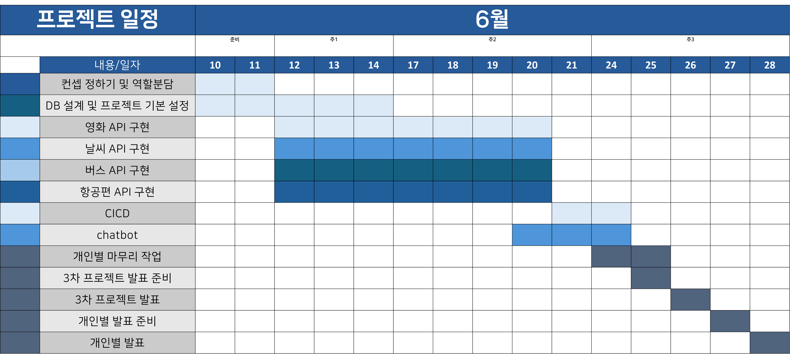

# 😀박준우 3차 프로젝트

### 시나리오형 챗봇 웹 개발

#### **● 프로젝트 명** : Group Air

#### **● 프로젝트 설명** : 항공사 그룹웨어 시스템 OpenAPI 추가 및 시나리오형 ChatBot

- **Preview** 
    - 버스 API
       
      
       
       
    - 공항 버스 API
       
      

#### **● 프로젝트 소개**

> 항공에서 근무하는 직원이 출결 및 게시판 사용, 항공편 조회 등을 위한 사이트
> 
> 직원이 명확하게 이해하기 쉽고 부서 간 의사소통이 원활하게 기능하는 조직도 구현
> 
> 대표이사, 부장, 사원 권한에 따라 관여할 수 있는 부분 제한
> 
> 한 눈에 알아볼 수 있는 UI 및 사용가치 있는 설계

#### **● 팀원**

> 박준우 (팀원) : 버스 노선도 API, 버스 위치 정보 API, 공항 버스 정보 조회 API

> 손** (팀원) : 영화 정보 Api, (주별 박스오피스) 전체 영화 목록, 영화 ChatBot, 상세 정보 조회

> 서** (팀장) : CI/CD, 영화 정보 Api, (일별 박스오피스) 상세 정보, 영화 ChatBot

> 정** (팀원) : 버스 ChatBot

> 조** (팀원) : 날씨 정보 Api, 공항 날씨, 날씨 ChatBot

 기술 스택 

| 카테고리       | 요소                                                                                                                 |
|------------|--------------------------------------------------------------------------------------------------------------------|
| 프로그래밍 언어   |               |
| 개발 툴       |  |
| 프레임워크      |      |
| 라이브러리 및 DI | Spring WEB(MVC), Lombok, SpringSecurity5  , websocket, validation, OAuth2, komoran, queryDsl                   |
| 데이터베이스     |                |
| ORM        | Spring Data JPA (JAVA(SQL))  , MyBatis                                                                             |
| 템플릿 엔진     |        |
| Frontend   | css, javaScript, html, ajax                                                                                        |
| API        | OpenWeather API, kakao Map API, 공공데이터 포털, 영화진흥위원회, tmdb                                                            |
| 설정         | application.yml, application-oauth2.yml                                                                            |

 프로젝트 일정 

 ER 다이어그램 

 기능 구현 

### 버스 노선도 API

| **No** | **기능**   | **설명**                          |
|--------|----------|---------------------------------|
| 1      | 버스 조회    | 버스 번호를 통한 버스 노선 조회, 버스 노선별 색 표시 |
| 2      | 노선 조회    | 정류장과 해당 버스 노선이 kakaoMap 으로 표시   |
| 3      | 정류장 조회   | 지도에 해당 정류장 표시                   |
| 4      | 정류장 상세조회 | 정류장 상세정보 및 로드뷰 표시               |

### 버스 위치 정보 API

| **No** | **기능**     | **설명**             |
|--------|------------|--------------------|
| 1      | 버스 위치 표시   | 해당 노선의 현재 버스 위치 표시 |
| 2      | 버스 도착 전 표시 | 다음 정류장 ID 표시       |

### 공항 버스 정보 조회 API

| **No** | **기능**   | **설명**          |
|--------|----------|-----------------|
| 1      | 지역 별 조회  | 도착지 별로 공항 버스 조회 |
| 2      | 버스 상세 정보 | 해당 버스 노선과 정보 표시 |

**[⬆ 위로 가기](#박준우-3차-프로젝트)**
